# Ionic 2 Conference Application

This is purely a demo of Ionic v2.0 and is still in development.


## Important!
**There is not an actual Ionic Conference at this time.** This project is just to show off Ionic v2.0 components in a real-world application.
Please go through the steps in [CONTRIBUTING.md](https://github.com/driftyco/ionic-conference-app/blob/master/CONTRIBUTING.md) before submitting an issue.


## Table of Contents
 - [Getting Started](#getting-started)
 - [Contributing](#contributing)
 - [App Preview](#app-preview)
  - [iPhone 6](#iphone-6)
  - [Nexus 5](#nexus-5)
 - [Use Cases](#use-cases)
 - [File Structure of App](#file-structure-of-app)


## Getting Started

* Clone this repository.
* Want to use TypeScript? Check out the `typescript` branch: `git checkout typescript` 
* Run `npm install` from the project root.
* Install the ionic CLI (`npm install -g ionic@beta`)
* Run `ionic serve` in a terminal from the project root.
* Profit

**Note:** Build slow? Update to `npm3`: `npm install -g npm`.


## Contributing
See [CONTRIBUTING.md](https://github.com/driftyco/ionic-conference-app/blob/master/CONTRIBUTING.md) :tada::+1:


## Use Cases

* Menu - [ [template](https://github.com/driftyco/ionic-conference-app/blob/master/app/app.html#L3-L21) |
[code](https://github.com/driftyco/ionic-conference-app/blob/master/app/app.js#L27-L32) ]
* Tabs - [ [template](https://github.com/driftyco/ionic-conference-app/blob/master/app/pages/tabs/tabs.html) | [code](https://github.com/driftyco/ionic-conference-app/blob/master/app/pages/tabs/tabs.js) ]
* Segments - [ [template](https://github.com/driftyco/ionic-conference-app/blob/master/app/pages/schedule/schedule.html#L6-L13) | [code](https://github.com/driftyco/ionic-conference-app/blob/master/app/pages/schedule/schedule.js#L24) ]
* Search bar - [ [template](https://github.com/driftyco/ionic-conference-app/blob/master/app/pages/schedule/schedule.html#L24-L29) | [code](https://github.com/driftyco/ionic-conference-app/blob/master/app/pages/schedule/schedule.js#L36-L41) ]
* Sliding items with buttons - [ [template](https://github.com/driftyco/ionic-conference-app/blob/master/app/pages/schedule/schedule.html#L38-L55) | [code](https://github.com/driftyco/ionic-conference-app/blob/master/app/pages/schedule/schedule.js#L60-L90) ]
* Modals - [ [template](https://github.com/driftyco/ionic-conference-app/blob/master/app/pages/schedule-filter/schedule-filter.html) | [code](https://github.com/driftyco/ionic-conference-app/blob/master/app/pages/schedule/schedule.js#L43-L52) ]
* Action Sheet - [ [template](https://github.com/driftyco/ionic-conference-app/blob/master/app/pages/speaker-list/speaker-list.html#L32) | [code](https://github.com/driftyco/ionic-conference-app/blob/master/app/pages/speaker-list/speaker-list.js#L34-L55) ]
* Toggle / switches - [ [template](https://github.com/driftyco/ionic-conference-app/blob/master/app/pages/schedule-filter/schedule-filter.html#L22-L25) ]
* Slides - [ [template](https://github.com/driftyco/ionic-conference-app/blob/master/app/pages/tutorial/tutorial.html#L2-L14) |
[code](https://github.com/driftyco/ionic-conference-app/blob/master/app/pages/tutorial/tutorial.js#L14-L39) ]
* Cards - [ [template](https://github.com/driftyco/ionic-conference-app/blob/master/app/pages/speaker-list/speaker-list.html#L9-L42) ]
* Sticky headers - [ [template](https://github.com/driftyco/ionic-conference-app/blob/master/app/pages/schedule/schedule.html#L34-L36) ]
* Grid - [ [template](https://github.com/driftyco/ionic-conference-app/blob/master/app/pages/login/login.html#L26-L33) ]
* Using Angular HTTP for JSON - [ [code](https://github.com/driftyco/ionic-conference-app/blob/master/app/providers/conference-data.js#L25-L30) | [usage](https://github.com/driftyco/ionic-conference-app/blob/master/app/pages/schedule/schedule.js#L36-L41) ]


## App Preview

### iPhone 6

<!-- GIF of iOS app -->
<br>
<!-- images of iOS app -->
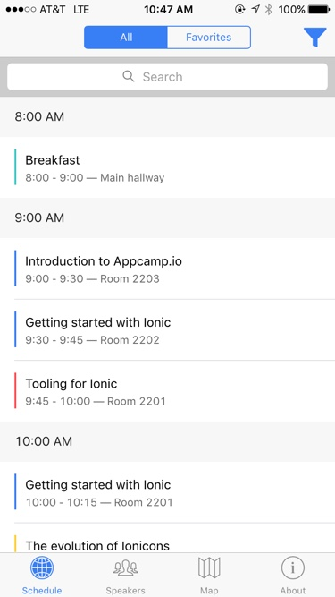

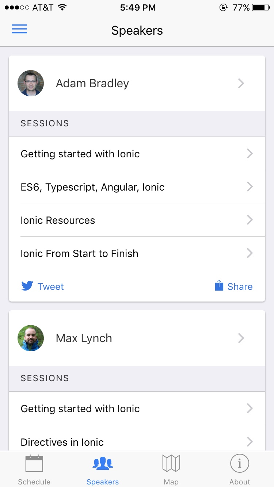
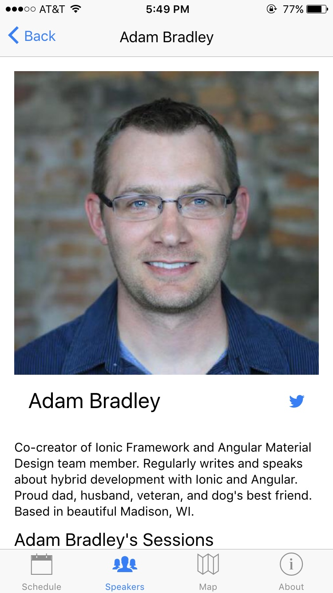
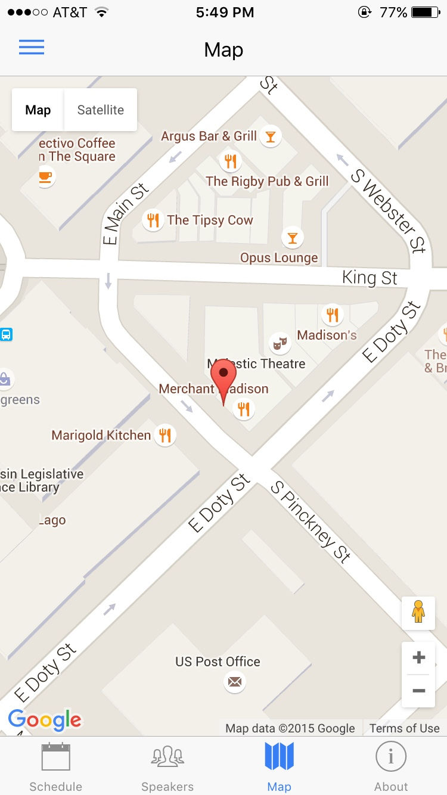
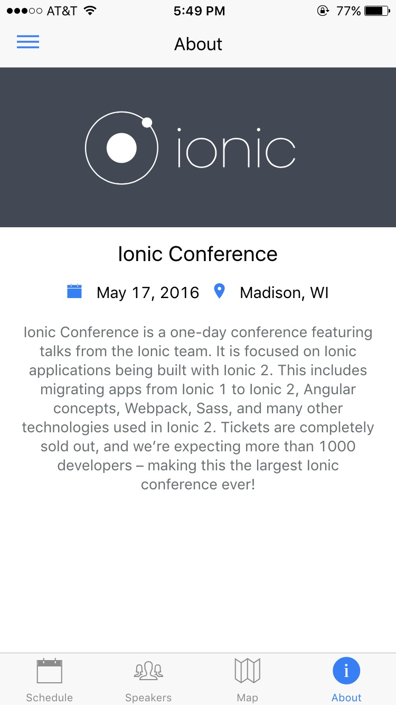


### Nexus 5

<!-- GIF of MD app -->
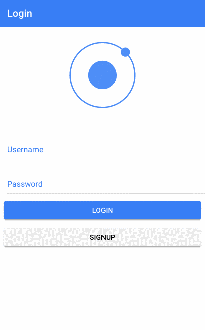<br>
<!-- GIF of MD app -->
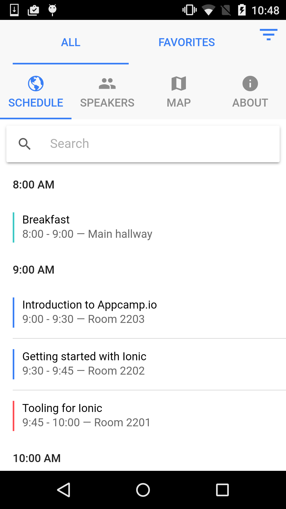
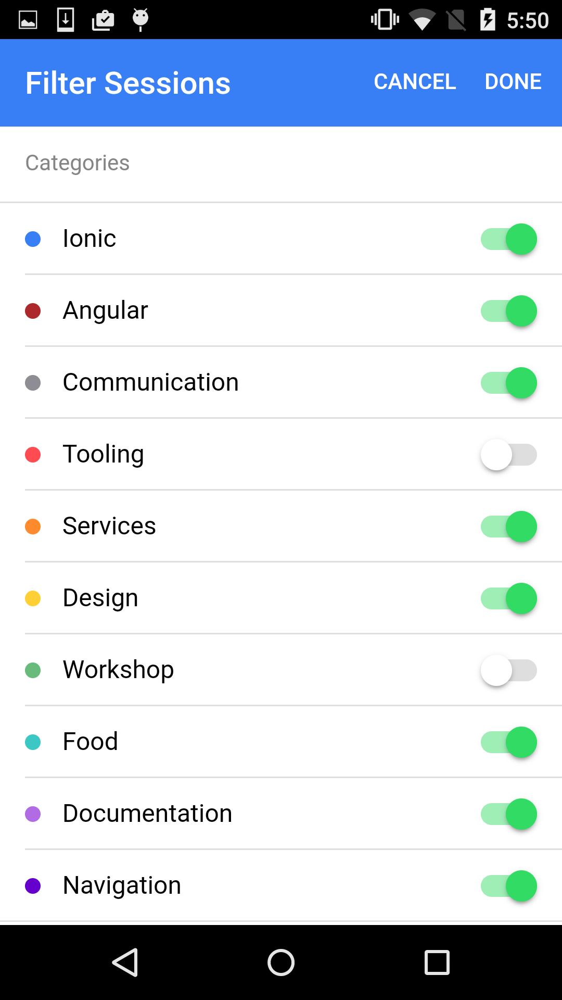
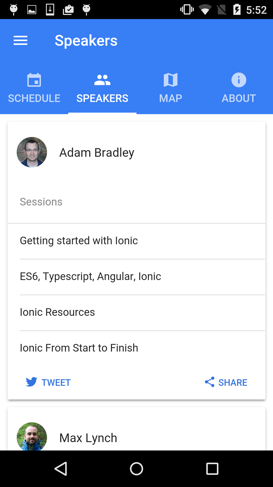
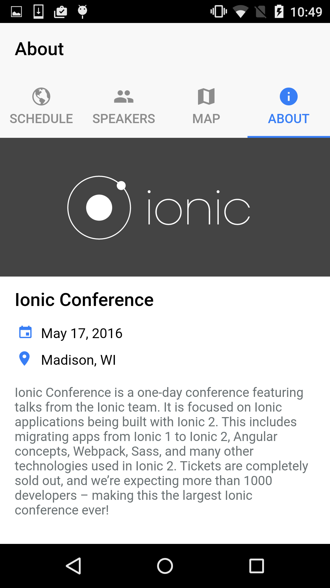
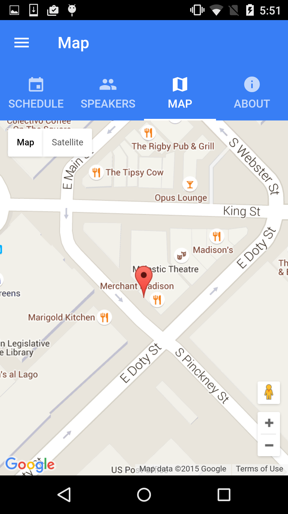


## File Structure of App

```
ionic-conference-app/
├── app/                               * Working directory
│   ├── pages/                         * Contains all of our pages
│   │   ├── about/                     * About tab page
│   │   │    ├── about.html            * AboutPage template
│   │   │    └── about.js              * AboutPage code
│   │   │    └── about.scss            * AboutPage stylesheet
│   │   │
│   │   │── login/                     * Login page
│   │   │    ├── login.html            * LoginPage template
│   │   │    └── login.js              * LoginPage code
│   │   │    └── login.scss            * LoginPage stylesheet
│   │   │
│   │   │── map/                       * Map tab page
│   │   │    ├── map.html              * MapPage template
│   │   │    └── map.js                * MapPage code
│   │   │    └── map.scss              * MapPage stylesheet
│   │   │
│   │   │── schedule/                  * Schedule tab page
│   │   │    ├── schedule.html         * SchedulePage template
│   │   │    └── schedule.js           * SchedulePage code
│   │   │    └── schedule.scss         * SchedulePage stylesheet
│   │   │
│   │   │── schedule-filter/           * Schedule Filter page
│   │   │    ├── schedule-filter.html  * ScheduleFilterPage template
│   │   │    └── schedule-filter.js    * ScheduleFilterPage code
│   │   │    └── schedule-filter.scss  * ScheduleFilterPage stylesheet
│   │   │
│   │   │── session-detail/            * Session Detail page
│   │   │    ├── session-detail.html   * SessionDetailPage template
│   │   │    └── session-detail.js     * SessionDetailPage code
│   │   │
│   │   │── signup/                    * Signup page
│   │   │    ├── signup.html           * SignupPage template
│   │   │    └── signup.js             * SignupPage code
│   │   │
│   │   │── speaker-detail/            * Speaker Detail page
│   │   │    ├── speaker-detail.html   * SpeakerDetailPage template
│   │   │    └── speaker-detail.js     * SpeakerDetailPage code
│   │   │    └── speaker-detail.scss   * SpeakerDetailPage stylesheet
│   │   │
│   │   │── speaker-list/              * Speakers tab page
│   │   │    ├── speaker-list.html     * SpeakerListPage template
│   │   │    └── speaker-list.js       * SpeakerListPage code
│   │   │    └── speaker-list.scss     * SpeakerListPage stylesheet
│   │   │
│   │   │── tabs/                      * Tabs page
│   │   │    ├── tabs.html             * TabsPage template
│   │   │    └── tabs.js               * TabsPage code
│   │   │
│   │   └── tutorial/                  * Tutorial Intro page
│   │        ├── tutorial.html         * TutorialPage template
│   │        └── tutorial.js           * TutorialPage code
│   │        └── tutorial.scss         * TutorialPage stylesheet
│   │
│   ├── providers/                     * Contains all Injectables
│   │   ├── conference-data.js         * ConferenceData code
│   │   └── user-data.js               * UserData code
│   │
│   ├── theme/                         * App theme files
│   │   ├── app.core.scss              * App Shared Sass Imports
│   │   ├── app.ios.scss               * iOS Sass Imports & iOS Variables
│   │   ├── app.md.scss                * MD Sass Imports & MD Variables
│   │   └── app.variables.scss         * App Shared Sass Variables
│   │
│   ├── app.html                       * Application template
│   └── app.js                         * Main Application configuration
│
|
├── node_modules/                      * Node dependencies
|
├── platforms/                         * Cordova generated native platform code
|
├── plugins/                           * Cordova native plugins go
|
├── resources/                         * Images for splash screens and icons
|
├── www/                               * Folder that is copied over to platforms www directory
│   │   
│   ├── build/                         * Contains auto-generated compiled content
│   │     ├── css/                     * Compiled CSS
│   │     ├── fonts/                   * Copied Fonts
│   │     ├── js/                      * ES5 compiled JavaScript
│   │     ├── pages/                   * Copied html pages
│   │     └── app.html                 * Copied app entry point
│   │
│   ├── data/                          * Contains data used for the app
│   │     └── data.json                * App data
│   │
│   ├── img/                           * App images
│   │
│   └── index.html                     * Main entry point
|
├── .editorconfig                      * Defines coding styles between editors
├── .gitignore                         * Example git ignore file
├── config.xml                         * Cordova configuration file
├── CONTRIBUTING.md                    * Information about contributing to this project
├── ionic.config.js                    * Ionic configuration file
├── LICENSE                            * Apache License
├── package.json                       * Our javascript dependencies
├── README.md                          * This file
└── webpack.config.js                  * Webpack configuration file
```
