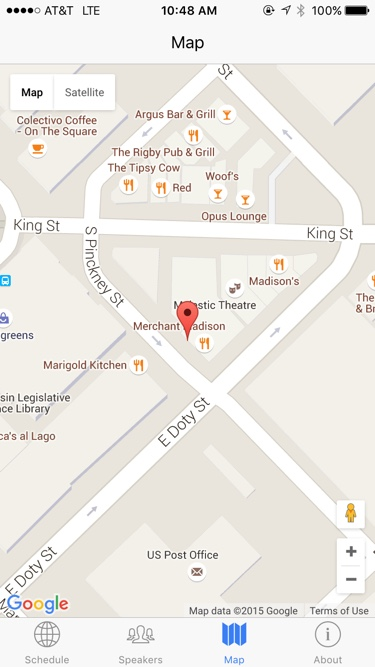
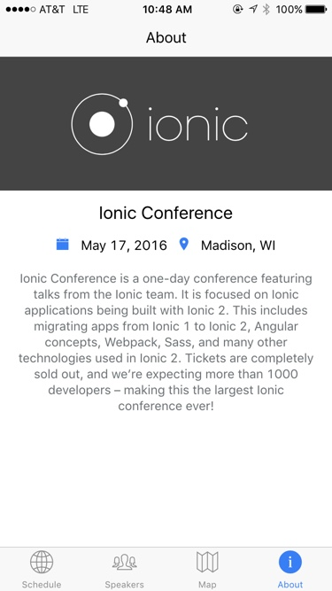
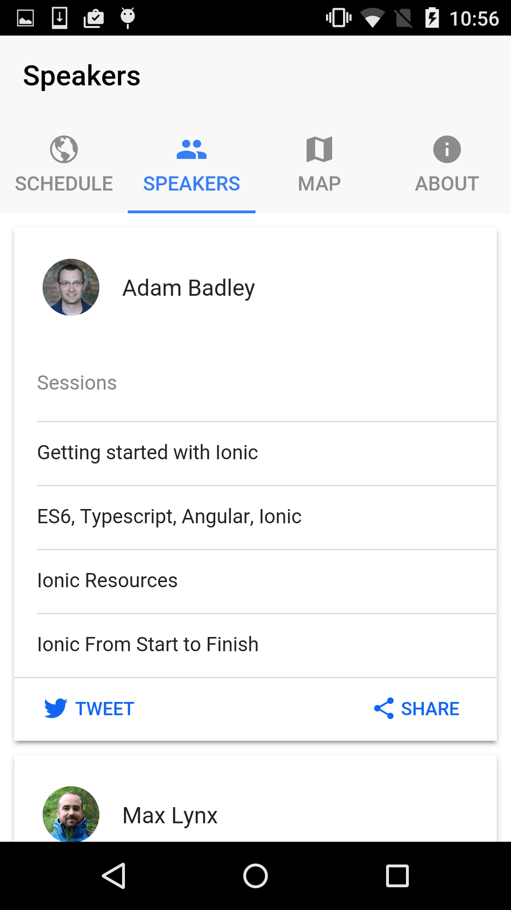
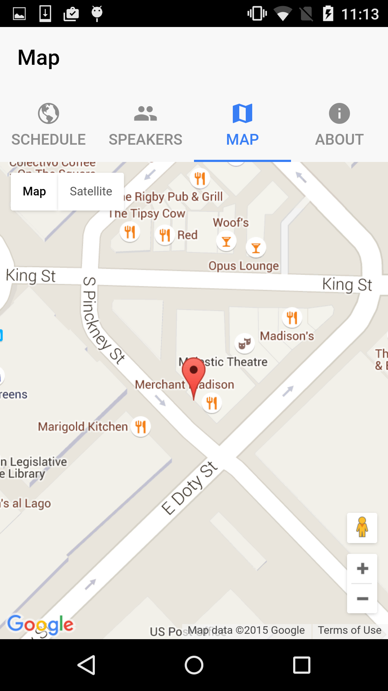

# Ionic 2 Conference Application

This is purely a demo of Ionic 2. This app is still in development.

## Getting started

* Clone this repository.
* Run `npm install` on project root.
* Install the ionic-cli if not already (`npm install -g ionic@alpha`)
* Run `ionic serve` in project root.
* Profit

## App Preview

### iPhone 6





### Nexus 5






## Use cases

* Tabs - [ [template](https://github.com/driftyco/ionic-conference-app/blob/master/www/app/app.html) | [code](https://github.com/driftyco/ionic-conference-app/blob/master/www/app/app.js) ]
* Segments - [ [template](https://github.com/driftyco/ionic-conference-app/blob/master/www/app/schedule/schedule.html#L4-L13) | [code](https://github.com/driftyco/ionic-conference-app/blob/master/www/app/schedule/schedule.js#L21-L23) ]
* Search bar - [ [template](https://github.com/driftyco/ionic-conference-app/blob/master/www/app/schedule/schedule.html#L21) | [code](https://github.com/driftyco/ionic-conference-app/blob/master/www/app/schedule/schedule.js#L54-L72) ]
* Sliding items with buttons - [ [template](https://github.com/driftyco/ionic-conference-app/blob/master/www/app/components/schedule-list.html#L6-L19) | [code](https://github.com/driftyco/ionic-conference-app/blob/master/www/app/components/schedule-list.js#L23-L72) ]
* Modals - [ [template](https://github.com/driftyco/ionic-conference-app/blob/master/www/app/modals/filter-schedule-modal.html) | [code](https://github.com/driftyco/ionic-conference-app/blob/master/www/app/schedule/schedule.js#L74-L76) ]
* Toggle / switches - [ [template](https://github.com/driftyco/ionic-conference-app/blob/master/www/app/modals/filter-schedule-modal.html#L17-L20) ]
* Cards - [ [template](https://github.com/driftyco/ionic-conference-app/blob/master/www/app/speakers/speakers.html#L7-L39) ]
* Sticky headers - [ [template](https://github.com/driftyco/ionic-conference-app/blob/master/www/app/components/schedule-list.html#L3-L5) ]
* Using Angular HTTP for JSON - [ [code](https://github.com/driftyco/ionic-conference-app/blob/master/www/app/service/data.js#L22-L26) | [usage](https://github.com/driftyco/ionic-conference-app/blob/master/www/app/schedule/schedule.js#L15-L18) ]

## File Structure of App

```
ionic-conference-app/
├── hooks/                             * Cordova hooks
|
├── node_modules/                      * Node dependencies
|
├── platforms/                         * Cordova generated native platform code
|
├── plugins/                           * Cordova native plugins go
|
├── resources/                         * Images for splash screens and icons
|
├── www/                               * Folder that is copied over to platforms www directory
│   ├── app/                           * Contains our application code
│   │   ├── about/                     * About page
│   │   │    ├── about.html            * Page template
│   │   │    └── about.js              * Page code
│   │   │
│   │   │── components/                * Example components
│   │   │       ├── date-format.js     * Import moment.js and format date
│   │   │       ├── schedule-list.js   * List component
│   │   │       └── schedule-list.html * List template
│   │   │
│   │   ├── app.html                   * Application template
│   │   ├── app.js                     * Main Application configuration
│   │   └── app.scss                   * Sass imports
│   │   
│   ├── build/                        * Contains compiled content
│   │     ├── css                     * Compiled CSS
│   │     ├── fonts                   * Copied Fonts
│   │     └── js                      * ES5 compiled JavaScript
│   │
│   ├── img/                          * App images
│   │
│   └── index.html                    * Main entry point
|
├── .gitignore                        * Example git ignore file
├── config.xml                        * Cordova config file
├── gulpfile.js                       * Gulpfile for tasks
├── ionic.project                     * Ionic project file
├── package.json                      * Our javascript dependencies
├── README.md                         * This file
├── tsconfig.json                     * Configures the TypeScript compiler
└── webpack.config.js                 * Our Webpack configuration
```

# More to come

We'll also be showing how to use native plugins:

- Camera access
- Geolocation

## Other great Angular 2 examples

- Angular 2 RxJS Chat: https://github.com/ng-book/angular2-rxjs-chat
