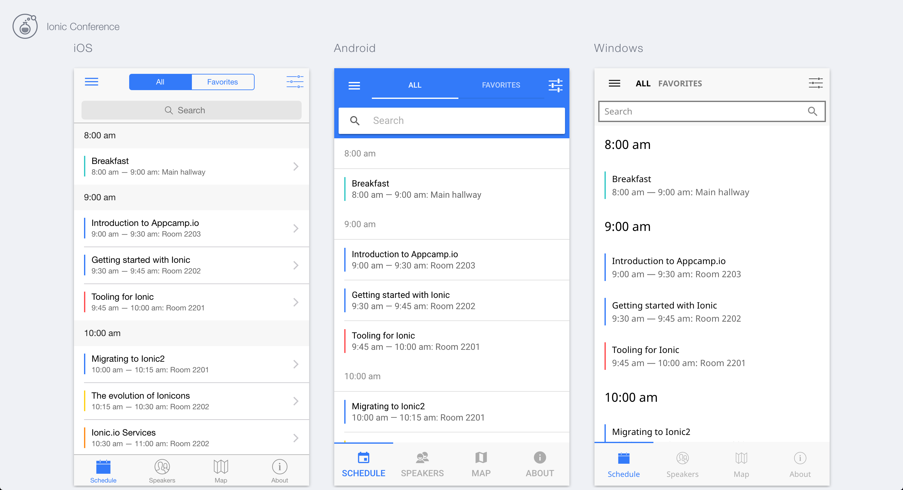
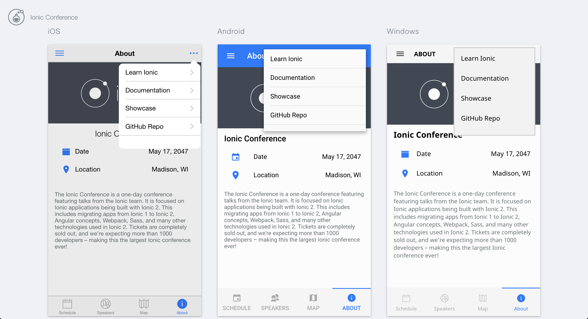

# Ionic Conference Application

This is the official Ionic demo app, showcasing a variety of Ionic Framework components and native features.

## Important!
**There is not an actual Ionic Conference at this time.** This project is just to show off Ionic components in a real-world application. Please go through the steps in [CONTRIBUTING.md](https://github.com/ionic-team/ionic-conference-app/blob/master/.github/CONTRIBUTING.md) before submitting an issue.


## Table of Contents
 - [Getting Started](#getting-started)
 - [Contributing](#contributing)
 - [Use Cases](#use-cases)
 - [App Preview](#app-preview)
 - [File Structure of App](#file-structure-of-app)


## Getting Started

* [Download the installer](https://nodejs.org/) for Node.js 6 or greater.
* Install the ionic CLI globally: `npm install -g ionic`
* Clone this repository: `git clone https://github.com/ionic-team/ionic-conference-app.git`.
* Run `npm install` from the project root.
* Run `ionic serve` in a terminal from the project root.
* Profit. :tada:

_Note: You may need to add “sudo” in front of any global commands to install the utilities._

## Contributing
See [CONTRIBUTING.md](https://github.com/ionic-team/ionic-conference-app/blob/master/.github/CONTRIBUTING.md) :tada::+1:


## Use Cases

* Action Sheet - [ [template](https://github.com/ionic-team/ionic-conference-app/blob/master/src/pages/speaker-list/speaker-list.html) | [code](https://github.com/ionic-team/ionic-conference-app/blob/master/src/pages/speaker-list/speaker-list.ts) ]
* Alert - [ [code](https://github.com/ionic-team/ionic-conference-app/blob/master/src/pages/schedule/schedule.ts) ]
* Cards - [ [template](https://github.com/ionic-team/ionic-conference-app/blob/master/src/pages/speaker-list/speaker-list.html) ]
* Datetime - [ [template](https://github.com/ionic-team/ionic-conference-app/blob/master/src/pages/about/about.html) ]
* Grid - [ [template](https://github.com/ionic-team/ionic-conference-app/blob/master/src/pages/login/login.html) ]
* Inputs - [ [template](https://github.com/ionic-team/ionic-conference-app/blob/master/src/pages/login/login.html) ]
* Items (Sliding) - [ [template](https://github.com/ionic-team/ionic-conference-app/blob/master/src/pages/schedule/schedule.html) | [code](https://github.com/ionic-team/ionic-conference-app/blob/master/src/pages/schedule/schedule.ts) ]
* Menu - [ [template](https://github.com/ionic-team/ionic-conference-app/blob/master/src/app/app.template.html) |
[code](https://github.com/ionic-team/ionic-conference-app/blob/master/src/app/app.component.ts) ]
* Modal - [ [template](https://github.com/ionic-team/ionic-conference-app/blob/master/src/pages/schedule-filter/schedule-filter.html) | [code](https://github.com/ionic-team/ionic-conference-app/blob/master/src/pages/schedule/schedule.ts) ]
* Searchbar - [ [template](https://github.com/ionic-team/ionic-conference-app/blob/master/src/pages/schedule/schedule.html) | [code](https://github.com/ionic-team/ionic-conference-app/blob/master/src/pages/schedule/schedule.ts) ]
* Segment - [ [template](https://github.com/ionic-team/ionic-conference-app/blob/master/src/pages/schedule/schedule.html) | [code](https://github.com/ionic-team/ionic-conference-app/blob/master/src/pages/schedule/schedule.ts) ]
* Slides - [ [template](https://github.com/ionic-team/ionic-conference-app/blob/master/src/pages/tutorial/tutorial.html) |
* Sticky headers - [ [template](https://github.com/ionic-team/ionic-conference-app/blob/master/src/pages/schedule/schedule.html) ]
* Tabs - [ [template](https://github.com/ionic-team/ionic-conference-app/blob/master/src/pages/tabs/tabs.html) | [code](https://github.com/ionic-team/ionic-conference-app/blob/master/src/pages/tabs/tabs.ts) ]
* Toggle - [ [template](https://github.com/ionic-team/ionic-conference-app/blob/master/src/pages/schedule-filter/schedule-filter.html) ]
[code](https://github.com/ionic-team/ionic-conference-app/blob/master/src/pages/tutorial/tutorial.ts) ]
* Using Angular HTTP for JSON - [ [code](https://github.com/ionic-team/ionic-conference-app/blob/master/src/providers/conference-data.ts) | [usage](https://github.com/ionic-team/ionic-conference-app/blob/master/src/pages/schedule/schedule.ts) ]


## App Preview

[Try it live](https://ionic-team.github.io/ionic-conference-app/www)

All app preview screenshots were taken by running `ionic serve --lab` on a retina display.

- [Schedule Page](https://github.com/ionic-team/ionic-conference-app/blob/master/src/pages/schedule/schedule.html)

  


- [About Page](https://github.com/ionic-team/ionic-conference-app/blob/master/src/pages/about/about.html)

  


- To see more images of the app, check out the [screenshots directory](https://github.com/ionic-team/ionic-conference-app/tree/master/resources/screenshots)!


## Deploying

* PWA - Un-comment [this](https://github.com/ionic-team/ionic2-app-base/blob/master/src/index.html#L21), run `npm run ionic:build --prod` and then push the `www` folder to your favorite hosting service
* Android - Run `ionic cordova run android --prod`
  - If you are deploying to Android 4.4 or below we recommend adding crosswalk: `cordova plugin add cordova-plugin-crosswalk-webview`
* iOS - Run `ionic cordova run ios --prod`

## File Structure of App

```
ionic-conference-app/
├-- .github/                            * GitHub files
│   ├── CONTRIBUTING.md                 * Documentation on contributing to this repo
│   └── ISSUE_TEMPLATE.md               * Template used to populate issues in this repo
|
|-- resources/
|
|-- src/
|    |-- app/
|    |    ├── app.component.ts
|    |    └── app.module.ts
|    |    └── app.template.html
|    |    └── main.ts
|    |
|    |-- assets/
|    |    ├── data/
|    |    |    └── data.json
|    |    |
|    |    ├── fonts/
|    |    |     ├── ionicons.eot
|    |    |     └── ionicons.svg
|    |    |     └── ionicons.ttf
|    |    |     └── ionicons.woff
|    |    |     └── ionicons.woff2
|    |    |
|    |    ├── img/
|    |
|    |-- pages/                          * Contains all of our pages
│    │    ├── about/                     * About tab page
│    │    │    ├── about.html            * AboutPage template
│    │    │    └── about.ts              * AboutPage code
│    │    │    └── about.scss            * AboutPage stylesheet
│    │    │
│    │    ├── account/                   * Account page
│    │    │    ├── account.html          * AccountPage template
│    │    │    └── account.ts            * AccountPage code
│    │    │    └── account.scss          * AccountPage stylesheet
│    │    │
│    │    │── login/                     * Login page
│    │    │    ├── login.html            * LoginPage template
│    │    │    └── login.ts              * LoginPage code
│    │    │    └── login.scss            * LoginPage stylesheet
│    │    │
│    │    │── map/                       * Map tab page
│    │    │    ├── map.html              * MapPage template
│    │    │    └── map.ts                * MapPage code
│    │    │    └── map.scss              * MapPage stylesheet
│    │    │
│    │    │── schedule/                  * Schedule tab page
│    │    │    ├── schedule.html         * SchedulePage template
│    │    │    └── schedule.ts           * SchedulePage code
│    │    │    └── schedule.scss         * SchedulePage stylesheet
│    │    │
│    │    │── schedule-filter/            * Schedule Filter page
│    │    │    ├── schedule-filter.html   * ScheduleFilterPage template
│    │    │    └── schedule-filter.ts     * ScheduleFilterPage code
│    │    │    └── schedule-filter.scss   * ScheduleFilterPage stylesheet
│    │    │
│    │    │── session-detail/            * Session Detail page
│    │    │    ├── session-detail.html   * SessionDetailPage template
│    │    │    └── session-detail.ts     * SessionDetailPage code
│    │    │
│    │    │── signup/                    * Signup page
│    │    │    ├── signup.html           * SignupPage template
│    │    │    └── signup.ts             * SignupPage code
│    │    │
│    │    │── speaker-detail/            * Speaker Detail page
│    │    │    ├── speaker-detail.html   * SpeakerDetailPage template
│    │    │    └── speaker-detail.ts     * SpeakerDetailPage code
│    │    │    └── speaker-detail.scss   * SpeakerDetailPage stylesheet
│    │    │
│    │    │── speaker-list/              * Speakers tab page
│    │    │    ├── speaker-list.html     * SpeakerListPage template
│    │    │    └── speaker-list.ts       * SpeakerListPage code
│    │    │    └── speaker-list.scss     * SpeakerListPage stylesheet
|    |    |
│    │    │── support/                   * Support page
│    │    │    ├── support.html          * SupportPage template
│    │    │    └── support.ts            * SupportPage code
│    │    │    └── support.scss          * SupportPage stylesheet
│    │    │
│    │    │── tabs/                      * Tabs page
│    │    │    ├── tabs.html             * TabsPage template
│    │    │    └── tabs.ts               * TabsPage code
│    │    │
│    │    └── tutorial/                  * Tutorial Intro page
│    │         ├── tutorial.html         * TutorialPage template
│    │         └── tutorial.ts           * TutorialPage code
│    │         └── tutorial.scss         * TutorialPage stylesheet
|    |
│    ├── providers/                      * Contains all Injectables
│    │     ├── conference-data.ts        * ConferenceData code
│    │     └── user-data.ts              * UserData code
│    ├── theme/                          * App theme files
|    |     ├── variables.scss            * App Shared Sass Variables
|    |
|    |-- index.html
|
|-- www/
|    ├── assets/
|    |    ├── data/
|    |    |    └── data.json
|    |    |
|    |    ├── fonts/
|    |    |     ├── ionicons.eot
|    |    |     └── ionicons.svg
|    |    |     └── ionicons.ttf
|    |    |     └── ionicons.woff
|    |    |     └── ionicons.woff2
|    |    |
|    |    ├── img/
|    |
|    └── build/
|    └── index.html
|
├── .editorconfig                       * Defines coding styles between editors
├── .gitignore                          * Example git ignore file
├── LICENSE                             * Apache License
├── README.md                           * This file
├── config.xml                          * Cordova configuration file
├── ionic.config.json                   * Ionic configuration file
├── package.json                        * Defines our JavaScript dependencies
├── tsconfig.json                       * Defines the root files and the compiler options
├── tslint.json                         * Defines the rules for the TypeScript linter
```
